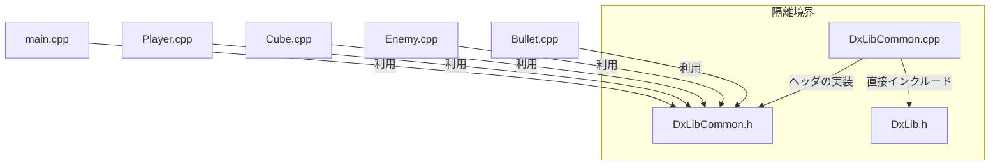
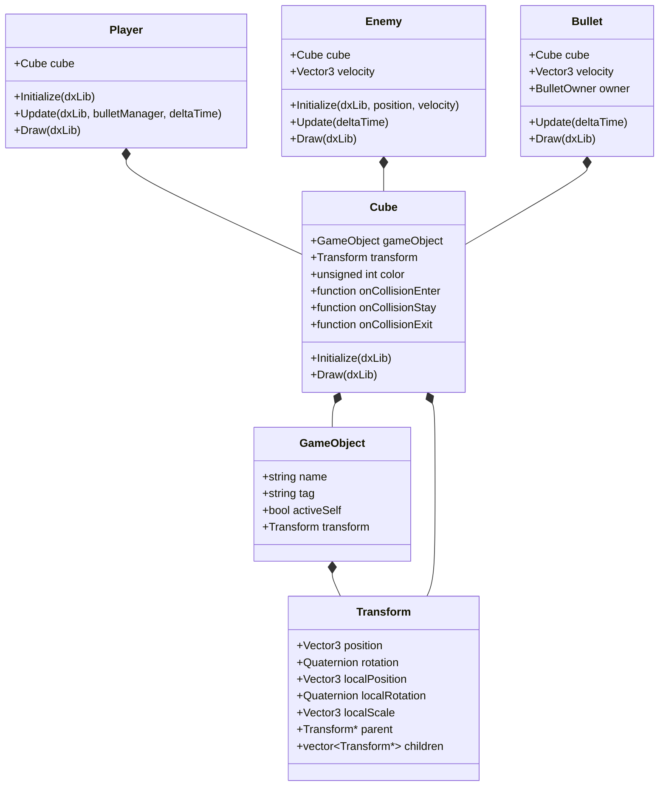
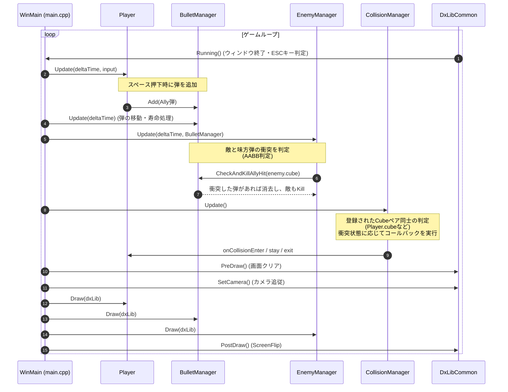

# プロジェクト見取り図

本プロジェクトは、**DxLib**を使用したC++による3Dアクションゲームの教育用または基礎開発用のサンプルプロジェクトです。

以下にプロジェクトのファイル構成、主要クラス、アーキテクチャ設計および動作フローについて整理します。

---

## 1. ファイル構成と役割

プロジェクトのルートディレクトリ内のファイルとそれぞれの役割です。

### 主要ソースコード
* [main.cpp](file:///D:/DirectXGames/cpp_3d_game/main.cpp)
  * ゲームのプロシージャルなメインエントリーポイント ([WinMain](file:///D:/DirectXGames/cpp_3d_game/main.cpp#L31))。ゲームループ、プレイヤー、敵、弾丸、衝突検出などの初期化、更新、描画、終了処理を制御します。
* [DxLibCommon.h](file:///D:/DirectXGames/cpp_3d_game/DxLibCommon.h) / [DxLibCommon.cpp](file:///D:/DirectXGames/cpp_3d_game/DxLibCommon.cpp)
  * DxLibのラッパークラス [DxLibCommon](file:///D:/DirectXGames/cpp_3d_game/DxLibCommon.h#L10)。他のファイルが直接 `DxLib.h` をインクルードしないように隔離する重要な役割を持ちます。
* [Vector3.h](file:///D:/DirectXGames/cpp_3d_game/Vector3.h)
  * 3D空間上の位置やスケールを表す単純な構造体 [Vector3](file:///D:/DirectXGames/cpp_3d_game/Vector3.h#L3)。
* [Quaternion.h](file:///D:/DirectXGames/cpp_3d_game/Quaternion.h)
  * 3D空間上の回転を表す構造体 [Quaternion](file:///D:/DirectXGames/cpp_3d_game/Quaternion.h#L3)。
* [Transform.h](file:///D:/DirectXGames/cpp_3d_game/Transform.h)
  * 位置・回転・スケール、および親子関係を管理する [Transform](file:///D:/DirectXGames/cpp_3d_game/Transform.h#L6) クラス。
* [GameObject.h](file:///D:/DirectXGames/cpp_3d_game/GameObject.h)
  * ゲーム内オブジェクトの基本データ（名前、タグ、アクティブ状態、[Transform](file:///D:/DirectXGames/cpp_3d_game/Transform.h#L6)）を持つ [GameObject](file:///D:/DirectXGames/cpp_3d_game/GameObject.h#L5) クラス。
* [Cube.h](file:///D:/DirectXGames/cpp_3d_game/Cube.h) / [Cube.cpp](file:///D:/DirectXGames/cpp_3d_game/Cube.cpp)
  * 3D空間に箱型を描画する [Cube](file:///D:/DirectXGames/cpp_3d_game/Cube.h#L8) クラス。衝突イベントのコールバック（[onCollisionEnter](file:///D:/DirectXGames/cpp_3d_game/Cube.h#L15)など）も提供します。
* [Player.h](file:///D:/DirectXGames/cpp_3d_game/Player.h) / [Player.cpp](file:///D:/DirectXGames/cpp_3d_game/Player.cpp)
  * プレイヤーの移動や弾の発射を司る [Player](file:///D:/DirectXGames/cpp_3d_game/Player.h#L7) クラス。
* [Enemy.h](file:///D:/DirectXGames/cpp_3d_game/Enemy.h) / [Enemy.cpp](file:///D:/DirectXGames/cpp_3d_game/Enemy.cpp)
  * 敵のデータと移動処理を司る [Enemy](file:///D:/DirectXGames/cpp_3d_game/Enemy.h#L7) クラス。
* [EnemyManager.h](file:///D:/DirectXGames/cpp_3d_game/EnemyManager.h) / [EnemyManager.cpp](file:///D:/DirectXGames/cpp_3d_game/EnemyManager.cpp)
  * 複数の敵をまとめて管理する [EnemyManager](file:///D:/DirectXGames/cpp_3d_game/EnemyManager.h#L8) クラス。
* [Bullet.h](file:///D:/DirectXGames/cpp_3d_game/Bullet.h) / [Bullet.cpp](file:///D:/DirectXGames/cpp_3d_game/Bullet.cpp)
  * 弾の移動や寿命を管理する [Bullet](file:///D:/DirectXGames/cpp_3d_game/Bullet.h#L9) クラス。
* [BulletManager.h](file:///D:/DirectXGames/cpp_3d_game/BulletManager.h) / [BulletManager.cpp](file:///D:/DirectXGames/cpp_3d_game/BulletManager.cpp)
  * 複数の弾をまとめて管理・衝突判定する [BulletManager](file:///D:/DirectXGames/cpp_3d_game/BulletManager.h#L7) クラス。
* [CollisionManager.h](file:///D:/DirectXGames/cpp_3d_game/CollisionManager.h) / [CollisionManager.cpp](file:///D:/DirectXGames/cpp_3d_game/CollisionManager.cpp)
  * 登録された `Cube` 同士のAABB衝突判定とコールバック（Enter/Stay/Exit）を実行する [CollisionManager](file:///D:/DirectXGames/cpp_3d_game/CollisionManager.h#L6) クラス。

### 学習教材・ドキュメント
* [01_00.md](file:///D:/DirectXGames/cpp_3d_game/01_00.md) 〜 [01_04.md](file:///D:/DirectXGames/cpp_3d_game/01_04.md)
  * 本プロジェクトの構築ステップを順に追う、C++およびゲームプログラミング初心者向けの学習ドキュメントです。
* [CLAUDE.md](file:///D:/DirectXGames/cpp_3d_game/CLAUDE.md)
  * 開発時のビルド方法、設計思想、コーディングルールが記載されたガイドラインファイルです。

### 構成設定・その他
* [2025DxLibSotuken.vcxproj](file:///D:/DirectXGames/cpp_3d_game/2025DxLibSotuken.vcxproj) / [CPPDXGamePrograming.sln](file:///D:/DirectXGames/cpp_3d_game/CPPDXGamePrograming.sln)
  * Visual Studio 2022 用のプロジェクト・ソリューションファイル。
* [Resources/](file:///D:/DirectXGames/cpp_3d_game/Resources)
  * キャラクター、敵、床などの3Dモデル（OBJ/MQO）およびテクスチャ（PNG/BMP/JPG）アセットの格納場所。
* [External/](file:///D:/DirectXGames/cpp_3d_game/External)
  * DxLib のヘッダーファイルと静的リンクライブラリ（SDK）が配置されています。

---

## 2. 最重要設計思想：DxLib隔離パターン

本プロジェクトの最重要ルールは、**「`DxLib.h` を `DxLibCommon.cpp` 以外の場所で直接インクルードしないこと」**です。



### 隔離する理由
`DxLib.h` は内部で `<windows.h>` をインクルードし、`min` / `max` などの競合しやすいマクロを多数定義します。これらがプロジェクト全体に漏洩すると、C++標準ライブラリ（特に `<algorithm>` など）と名前衝突を起こし、不必要なビルドエラーの原因になります。

---

## 3. 主要クラスの構造と関連

本プロジェクトのオブジェクトモデルは、Unityに似た構造（`GameObject` - `Transform` - `Cube`）を採用しつつ、コンポーネント指向ではなく明示的なメンバーとして持つ手法を取っています。

### クラス設計



> [!NOTE]
> `Cube` クラスは `GameObject` をメンバに持っており、`GameObject` も `Transform` を持っていますが、`Cube` 自体も独立した `Transform` メンバを持っています。これは描画や位置指定時に `Cube` 側の `Transform` が直接参照される実装になっています。

---

## 4. ゲームループと主要システムの協調動作

[main.cpp](file:///D:/DirectXGames/cpp_3d_game/main.cpp) の [WinMain](file:///D:/DirectXGames/cpp_3d_game/main.cpp#L31) 内で動作するゲームループでは、オブジェクトの更新、衝突判定、描画が整理された順序で実行されます。

### 処理のシーケンス



---

## 5. 当たり判定（衝突検出）の二重系について

現在、プロジェクトには**2つの異なる当たり判定システム**が存在します。

1. **マネージャーによる簡易判定 (弾 vs 敵)**
   * `EnemyManager::Update` から直接 [BulletManager::CheckAndKillAllyHit](file:///D:/DirectXGames/cpp_3d_game/BulletManager.cpp#L30) を呼び出し、AABBによる重なりをその場で計算してライフ（`isAlive_`）を操作しています。
2. **`CollisionManager` によるイベント駆動判定 (その他の静的/動的オブジェクト)**
   * 任意の `Cube` を [CollisionManager::Register](file:///D:/DirectXGames/cpp_3d_game/CollisionManager.cpp#L5) に登録することで、登録された全てのCube間で毎フレーム [CheckAABB](file:///D:/DirectXGames/cpp_3d_game/CollisionManager.cpp#L31) が走り、[onCollisionEnter](file:///D:/DirectXGames/cpp_3d_game/Cube.h#L15) などのイベントコールバックを相互に実行します。現状は `main.cpp` で `player.cube` のみが登録されており、他のオブジェクトとのペアがないため何も起こりません（衝突相手が追加登録されることで動作します）。

---

## 6. 設計ガイドライン `CLAUDE.md` との乖離点

[CLAUDE.md](file:///D:/DirectXGames/cpp_3d_game/CLAUDE.md) には以下の警告が記載されています。

> `Transform.h` で `<vector>` をインクルードしてはいけない。MSVC の STL が `std::transform` を引き込み、メンバ名 `transform` と競合してコンパイルエラーになる。親子関係の `children` が必要になった場合は生ポインタ配列か別ファイルで管理する。

しかし、実際の [Transform.h](file:///D:/DirectXGames/cpp_3d_game/Transform.h) は現在以下のようになっています。
```cpp
#include <vector>
// ...
std::vector<Transform*> children = {};
```
これは、一部のコンパイラ環境では `transform` というメンバ名が `std::transform` とバッティングしてエラーを吐く可能性があるため、注意が必要です。現状でビルドが通っている場合は、`using namespace std;` などの記述がない、もしくは競合が発生していない可能性がありますが、将来的な移植やコンパイラ変更時には注意すべきポイントです。
